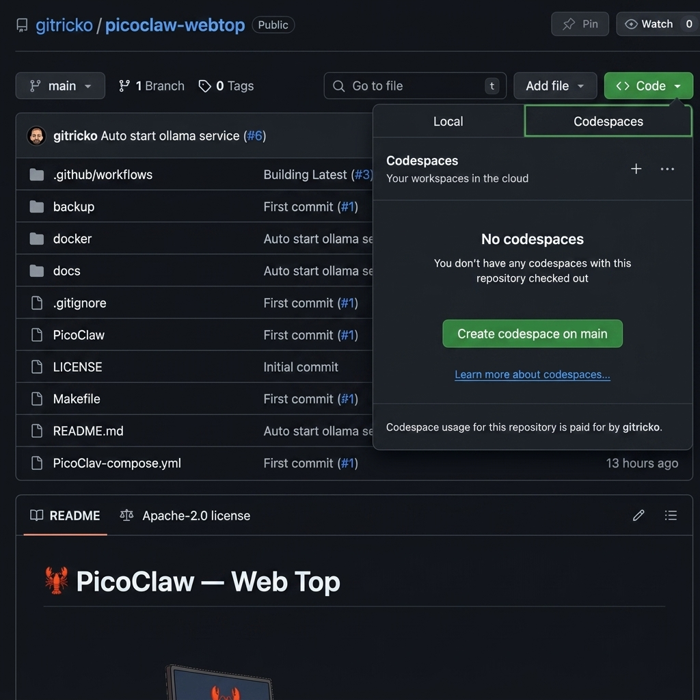

# 🦞 PicoClaw — Web Top
_Run picoclaw securely without any dedicated mac-mini, hostinger or gpu._
<p align="center">
    <picture>
        
    </picture>
</p>

<p align="center">
  <strong>Brew your lobster securely without breaking your bank</strong>
</p>

<p align="center">
<a href="https://github.com/gitricko/picoclaw-webtop/actions/workflows/docker-publish.yml">
    
  </a>
  <a href="LICENSE">
    
  </a>
  <a href="https://github.com/gitricko/picoclaw-webtop/issues">
    
  </a>
</p>

**PicoClaw-WebTop** gives you a **fully functional PicoClaw personal AI assistant** in your browser in under 20 minutes — no powerful PC, no Docker on your machine, no GPU required.

Just open this repo in a GitHub Codespace and you get:
- A complete Ubuntu MATE desktop (WebTop)
- Ollama server pre-installed and auto-started
- PicoClaw globally installed and ready to run
- Persistent volume for your config, pairings, and PicoClaw ID

When you’re ready to go production, simply move the same Docker setup to your own machine or VPS. *

## ✨ Why This Exists

PicoClaw (the core project) is the ultra-lightweight Go version of OpenClaw, connecting LLMs directly to your WhatsApp, Telegram, Slack, Discord, etc. It runs fast, uses <10MB RAM, and can spawn sub-agents and give you a beautiful dashboard.

The only catch? You normally need a dedicated machine.  
**PicoClaw-WebTop removes that catch completely.**

Perfect for:
- Trying PicoClaw risk-free
- Students / hackers / evaluators
- Anyone who wants to “brew their lobster” securely on free cloud credits

## 🚀 Quick Start (15–20 minutes)

1. **Open this repository in a GitHub Codespace** (big green “Code” button → Codespaces → New)
   
3. In the Codespace terminal run:
   ```bash
   make start
   ```
   (or `make start-locally-baked` if you prefer a pre-built image)
4. Wait ~60 seconds. When the web desktop URL appears in the Codespace Ports tab, click it.
   _In the Codespaces **Ports** tab, open the forwarded WebTop URL shown for the desktop service._

5. Inside the WebTop desktop:
- Open a terminal → `ollama signin` (sign in via the Chromium browser that pops up)
- Pull a model: `ollama pull minimax-m2.7:cloud` (or any model you like)
- Start the UI launcher: `picoclaw-launcher`
- Finally, open the browser inside WebTop and go to `http://localhost:18800`.

You now have a **fully working PicoClaw instance running 100% in the cloud.**

## 🔧 Features

- **Zero local install** — everything runs in browser via GitHub Codespaces
- **Free-tier friendly** — uses Ollama daily cloud credits + NVIDIA Build API fallback
- **Persistent config** — if docker volume backup and restore after Codespace recreation
- **Easy backup/restore** — `make backup` / `make restore`
- **One-command everything** — powerful Makefile + clean `docker-compose.yml`
- **Auto-start Ollama** — custom init script on WebTop boot
- **NVIDIA Build fallback** built-in
- **Colima / local Docker support** ready

## 🔒 Security: Protected by GitHub Authentication

**The WebTop URI is automatically protected — no one else can reach it.**

GitHub Codespaces forwards ports **privately by default** (this is the setting the `make start` command uses). According to official [GitHub documentation](https://docs.github.com/en/enterprise-cloud@latest/codespaces/reference/security-in-github-codespaces):

> “All forwarded ports are private by default, which means that you will need to authenticate before you can access the port.”  
> “Privately forwarded ports: Are accessible on the internet, but **only the codespace creator can access them, after authenticating to GitHub**.”

### How the protection actually works
- The URL you click in the **Ports** tab (`https://<your-codespace>-3000.app.github.dev`) is guarded by **GitHub authentication cookies**.
- These cookies expire every **3 hours** — you’ll simply be asked to log in again (super quick).
- If someone tries to open the link in an incognito window, via curl, or from another computer without being logged into **your** GitHub account, they are redirected to the GitHub login page or blocked.
- You (and only you) can access the full Ubuntu desktop, the browser inside it, Ollama, PicoClaw launcher, and everything else.

### Extra security layers built-in
- The entire environment runs in an **isolated GitHub-managed VM** — not on your laptop.
- Codespaces are **ephemeral**: delete the codespace and everything disappears (except the backed-up volume you control).
- TLS encryption is handled automatically by GitHub.
- The `GITHUB_TOKEN` inside the codespace is scoped only to this repo and expires when you stop/restart.
- We never set the port to “Public” or even “Private to Organization” — it stays strictly private to you.

**Bottom line**: This is actually **more secure** for experimentation than running Docker locally on your personal machine (no accidental exposure, no firewall holes, no persistent processes on your hardware).

**For production use** we still recommend moving the same Docker image to your own VPS or server with additional hardening (firewall, HTTPS reverse proxy, strong secrets, etc.). This Codespace version is perfect for safe testing and development.

## 💾 Backup & Restore
Your PicoClaw ID, device pairings, and configuration are persisted in a Docker volume.
The project includes convenient `make` targets to back up and restore this data in codespace:
```bash
make backup          # creates backup/picoclaw_config_backup.tar.gz
make restore         # restores from backup/picoclaw_config_backup.tar.gz
```
### When to Use It
- Migrating from GitHub Codespaces to a local machine or VPS
- Testing experimental changes without risking your current setup
- Quickly cloning your working environment into a fresh Codespace or container

### How to Migrate to a New Environment
- In your current environment, run `make backup`.
- Download the generated file: `backup/picoclaw_config_backup.tar.gz`.
- Place the file in the `backup/` folder of the new environment.
- Run `make restore`.

**💡 Tip:** Always back up before making significant changes. The restore process will overwrite the existing volume data, so test in a separate environment first if you're unsure.

## 🛠️ Advanced Usage
Run locally (no Codespaces)
```bash
make docker-build            # especially if you modified the ./docker/Dockerfile
make start-locally-baked     # start from your local bake image
```

### NVIDIA Build API as Free Fallback Model (Optional but Recommended)
NVIDIA offers free inference endpoints for powerful models like Moonshot AI's Kimi K2 (e.g., kimi-k2-instruct) through their Build platform. These make an excellent low-cost or zero-cost fallback when your primary model hits rate limits or goes down.

#### Step-by-Step Setup
- Go to [NVIDIA Build](https://build.nvidia.com/) and sign in (free NVIDIA Developer account required).
- Navigate to the Models tab and find a Free Endpoint. Good choices: `moonshotai/kimi-k2-instruct`
- Click on the model. This opens a chat interface.
- Click the **View Code** button (usually top-right).
- In the "Copy Code to Make an API Request" panel:
  - Click **Generate API Key** — the key will automatically appear in the code sample.
  - Copy the entire Python code snippet.
- Paste the code into a chat with PicoClaw and use this prompt:
```
Hey, here's the Python code from NVIDIA Build to call an API with a model (my API key already included). 
1. Test the code to make sure it works.
2. Configure this model as a fallback for my primary model.
```
- PicoClaw should automatically detect the OpenAI-compatible endpoint, extract the key, and set it up as a fallback.
- _Screenshot of the NVIDIA Build API setup flow coming soon._


## ⚠️ Current Limitations (honest)

- GitHub Codespaces free tier has monthly limits (great for testing, less ideal for 24/7 as Codespace auto-shutdown during inactivity)
- Ollama cloud [credits](https://ollama.com/settings) are daily — heavy use will push you to paid/local models. Or if you have multiple accounts, just `ollama signout` and `ollamasignin` with different account.
- Browser desktop has slight latency vs native (expected). You can shutdown your codespace and [change](https://docs.github.com/en/codespaces/customizing-your-codespace/changing-the-machine-type-for-your-codespace) to 4-core codespace to improve responsiveness or the need to run heavy applications.

<!--
Dashboard running inside WebTop
WhatsApp pairing flow
Agent in action
-->

## 🛣️ Roadmap

 - [ ] More screenshots + video demo
 - [ ] Full pairing automation scripts
 - [ ] Pre-built Docker image tags for stable releases
 - [ ] Community templates (Telegram-only, WhatsApp-only, etc.)
 - [ ] One-click “deploy to VPS” guide (Railway / Fly.io / cheap VPS) ?

## 🤝 Contributing
This is a one-person weekend project right now — every star, issue, or PR helps enormously!
Feel free to open issues for bugs or feature requests.

[](https://www.star-history.com/#gitricko/picoclaw-webtop&type=date&legend=top-left)

## 📄 License
MIT — see [LICENSE](./LICENSE)